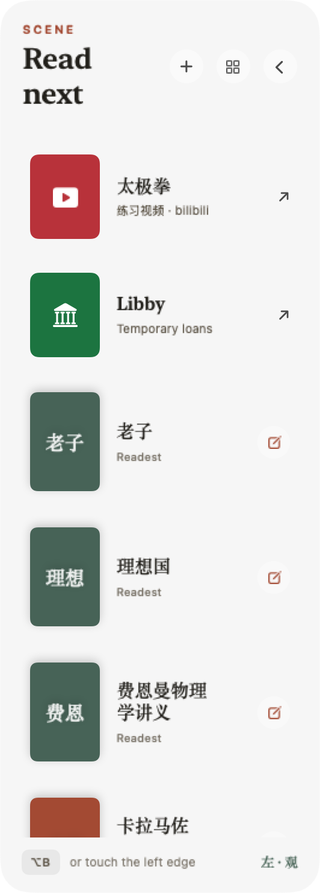

# Scene

Scene is a quiet reading dock for macOS. Touch the far-left edge or press `⌥B`; your chosen books arrive, and the shelf leaves when you do.



## What it does

- Reads EPUB and PDF files without changing them.
- Keeps a small featured shelf in front and the full library one click away.
- Routes each book to Apple Books, Readest, or its system default reader.
- Opens Libby as a separate lending source.
- Optionally hands a book context to the separately installed Mirror app.

The default library is `~/Documents/Knowledge/Books/real`. Per-book reader choices live in `~/Library/Application Support/Scene/library.json`.

## Build

Requires macOS 13+ and a Swift 5.9+ toolchain.

```sh
make verify
make install
make interaction-test
```

Scene and Mirror are separate products and repositories. Their only integration is the documented, versioned capture-draft handoff in [`Docs/CONTRACT.md`](Docs/CONTRACT.md).

`SIGN_IDENTITY` may select a stable code-signing identity. On the author's machine the build automatically reuses `Look Signing`, so macOS privacy grants survive local upgrades instead of following an ad-hoc binary hash.

MIT License.
