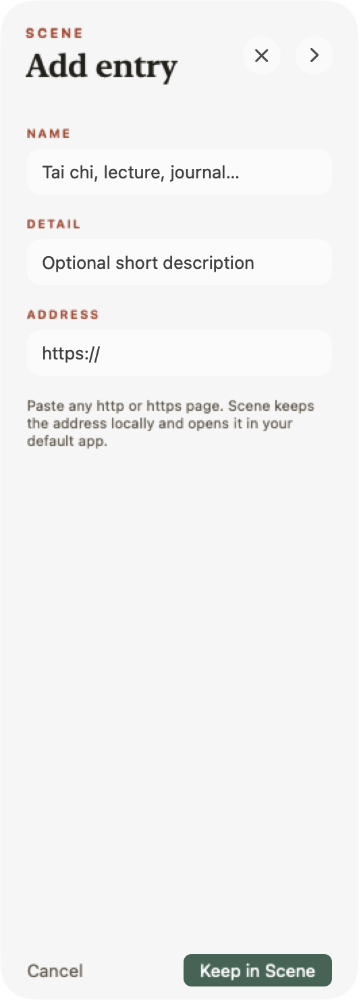

# Scene

Scene is a quiet reading and practice dock for macOS. Touch its chosen screen edge or press `⌥B`; books, websites, and videos arrive from that edge and leave through it. Choose Left or Right from the menu.


## What it does

- Reads EPUB and PDF files without changing them.
- Keeps a small featured shelf in front and the full library one click away.
- Routes each book to Apple Books, Readest, or its system default reader.
- Keeps editable website and video entrances beside books. The defaults include the requested **太极拳** Bilibili practice video and Libby.
- Optionally hands a book context to the separately installed Mirror app.
- Persists a left/right Dock side and mirrors the sensor, shelf, arrow, hint, animation, and rearm zone together.
- Reveals and begins hiding from the originating pointer or shortcut event—there is no dwell timer in either direction.

Press `+` to add an entrance, paste its complete `http` or `https` address, and choose **Keep in Scene**. Right-click an entrance to open, edit, or remove it; removal asks for confirmation. An empty list stays empty, so deleted defaults are not recreated. Clicking an entrance opens it in the default app and hides Scene immediately.



The default library is `~/Documents/Knowledge/Books/real`. Per-book reader choices, Dock side, and custom entrances live in `~/Library/Application Support/Scene/library.json`.

## Build

Requires macOS 13+ and a Swift 5.9+ toolchain.

```sh
make verify
make install
make interaction-test
```

Scene and Mirror are separate products and repositories. Their only integration is the documented, versioned capture-draft handoff in [`Docs/CONTRACT.md`](Docs/CONTRACT.md).

`SIGN_IDENTITY` may select a stable code-signing identity. On the author's machine the build automatically reuses `Look Signing`, so macOS privacy grants survive local upgrades instead of following an ad-hoc binary hash.

MIT License.
